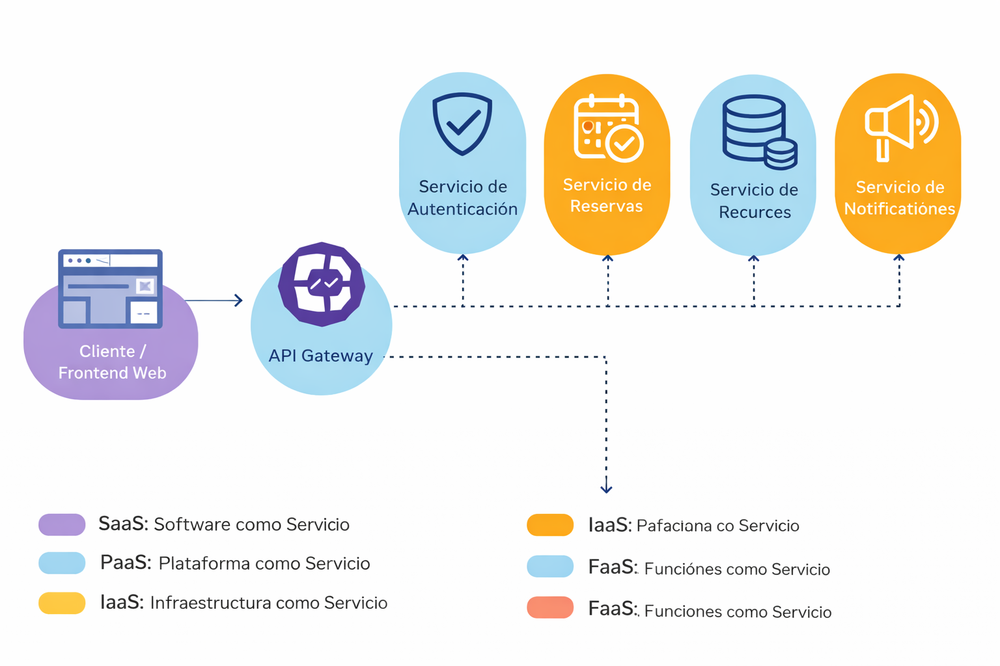

# Proyecto Nube Sólida  
## Diseño Arquitectónico de una Solución Cloud

**Autora:** Nathalie C.  
**Módulo:** Fundamentos de la Arquitectura Cloud Modulo N3

---

## Resumen general del proyecto

El proyecto **Nube Sólida** presenta el diseño conceptual de una arquitectura en la nube para un sistema de reservas, desarrollado desde una **perspectiva arquitectónica** y alineado con buenas prácticas de la computación cloud.

La solución responde a un escenario realista de modernización tecnológica, donde una organización requiere mejorar la **escalabilidad, resiliencia y seguridad** de sus aplicaciones, evitando arquitecturas monolíticas rígidas o accesos inseguros a los datos.

A lo largo del proyecto se analizan y justifican decisiones clave relacionadas con:
- El modelo cliente-servidor
- Los modelos de servicio en la nube
- El modelo de implementación
- Los principios de diseño arquitectónico
- Los atributos de calidad fundamentales

El foco no está puesto en la implementación de código, sino en la **correcta definición de la arquitectura**, su coherencia técnica y su alineación con entornos cloud modernos.

---

## Contexto del problema

En sistemas de reservas reales se manejan datos sensibles, alta concurrencia de usuarios y variaciones importantes de carga.  
Una mala decisión arquitectónica —como permitir el acceso directo del cliente a la base de datos— puede derivar en:

- Riesgos de seguridad
- Dificultad para escalar
- Problemas de mantenimiento
- Baja resiliencia ante fallos

El desafío principal consiste en **diseñar una arquitectura que permita a los usuarios interactuar con el sistema de forma segura, controlada y escalable**, preparada para operar en la nube.

---

## Enfoque de la solución

La solución propuesta se basa en una **arquitectura cliente-servidor**, evolucionada hacia un enfoque moderno preparado para microservicios y despliegue cloud.

Los principios que guían el diseño son:
- Separación de responsabilidades
- Desacoplamiento entre componentes
- Escalabilidad bajo demanda
- Seguridad desde el diseño
- Resiliencia ante fallos

Cada decisión arquitectónica está documentada y justificada a lo largo de las distintas lecciones que componen el proyecto.

---

## Diagrama conceptual de la solución

El siguiente diagrama representa la arquitectura general del sistema y sirve como base para todas las decisiones analizadas en el proyecto:

Este esquema muestra la separación entre:
- Capa de cliente
- Capa de servicios
- Capa de datos  
así como los flujos controlados de comunicación entre ellas.

---

## Estructura del proyecto

El repositorio se encuentra organizado de la siguiente manera:

- `readme.md` – Documento integrador del proyecto  
- `diagrama.html` – Representación visual de la arquitectura  
- `diagrama_l2.png` – Diagrama conceptual de la solución  
- `LeccionN1.doc` – Fundamentos de la computación en la nube  
- `LeccionN2.doc` – Modelos de servicio en la nube  
- `LeccionN3.doc` – Modelos de implementación  
- `LeccionN4.doc` – Principios de diseño arquitectónico  
- `LeccionN5.doc` – Atributos de calidad  

---

## Desarrollo por lecciones

### Lección 1 – Contexto y fundamentos de la computación en la nube  
📄 Documento: [LeccionN1.doc](./LeccionN1.doc)

En esta lección se establece el contexto del problema y se introducen los fundamentos de la computación en la nube, sus beneficios y características principales.  
Este análisis permite comprender por qué la nube es el entorno adecuado para la solución propuesta.

---

### Lección 2 – Modelos de servicio en la nube  
📄 Documento: [LeccionN2.doc](./LeccionN2.doc)

Se analizan los modelos IaaS, PaaS, SaaS y FaaS, asignando el modelo más adecuado a cada componente de la arquitectura cliente-servidor.  
Cada decisión se justifica considerando el nivel de control, flexibilidad y responsabilidad requerido.

---

### Lección 3 – Modelos de implementación en la nube  
📄 Documento: [LeccionN3.doc](./LeccionN3.doc)

En esta etapa se comparan los modelos de implementación (nube pública, privada e híbrida) y se selecciona el más adecuado para la solución.  
La decisión se fundamenta en aspectos de seguridad, costos, flexibilidad y necesidades del negocio.

---

### Lección 4 – Principios de diseño arquitectónico  
📄 Documento: [LeccionN4.doc](./LeccionN4.doc)

Se aplican principios fundamentales como modularidad, desacoplamiento, elasticidad y resiliencia.  
Esta lección consolida todas las decisiones previas en un diseño estructurado de arquitectura cliente-servidor preparado para entornos cloud.

---

### Lección 5 – Atributos de calidad  
📄 Documento: [LeccionN5.doc](./LeccionN5.doc)

Se detallan las estrategias arquitectónicas adoptadas para garantizar:
- Seguridad de la información
- Resiliencia ante fallos
- Escalabilidad frente a picos de demanda  

Estos atributos se integran de forma transversal en toda la arquitectura.

---

## Conclusión general

El proyecto **Nube Sólida** presenta una solución arquitectónica coherente, escalable y segura, alineada con los fundamentos de la computación en la nube y con prácticas utilizadas en entornos profesionales.

La arquitectura propuesta no solo resuelve el problema planteado, sino que queda preparada para evolucionar, adaptarse a nuevas cargas y ser desplegada sobre plataformas cloud modernas.

Este trabajo demuestra criterio en la toma de decisiones arquitectónicas y una comprensión sólida de los principios que rigen el diseño de soluciones cloud robustas.

---